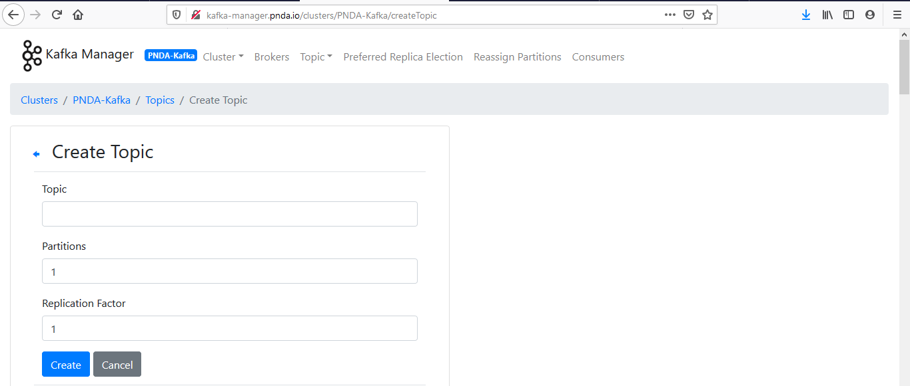

Example of Streaming Application
--------------------------------

Overview
--------

The example streaming application shows an example of an application
that can be deployed using the PNDA Deployment Manager. (See the
platform-deployment-manager project for details.)

The application is a tar file containing binaries and configuration
files required to perform stream processing.

This example application reads randomly generated messages from Kafka
topic and display on the console.

Requirements
------------

-   [*Maven*](https://maven.apache.org/docs/3.0.5/release-notes.html)
    3.0.5

-   [*Java
    JDK*](https://docs.oracle.com/javase/8/docs/technotes/guides/install/install_overview.html)
    1.8

Package Structure
-----------------

The package structure is as follows:
```
spark-streaming-consumer-app-2.3.1.tar.gz
    spark-streaming-consumer-app-2.3.1
        sparkStreaming (Component type)
           examples
                application.properties
               log4j.properties
               properties.json
       spark-streaming.jar
```
-   Packages are archived and compressed using tar and gzip and take the
    name of the associated artefact and version, following [strict
    versioning](http://legacy.python.org/dev/peps/pep-0386).

-   Packages must have a three part version number, e.g.
    spark-streaming-consumer-app-2.3.1.tar.gz.

-   The folder inside the package tar must have the same name as the
    archive .

-   The component types are taken from a controlled list.

-   Component names are chosen by the package developer and will be used
    by the Deployment Manager.

-   Each component type has a distinct structure specification.

Build
------

Edit the streaming-app/pom.xml file with the correct dependencies. Refer
to the Cloudera or Hortonworks version matrix to work out what version
this should be.

To build the example applications use:

mvn clean package

This command should be run at the root of the repository and will build
the application binary, and the application package. It will create a
package file in the app-package/target directory. It will be called
spark-streaming-consumer-app-2.3.1.tar.gz.

Files in the package
--------------------

-   **application.properties:** config file used by the Spark Streaming
    Scala application.

-   **log4j.properties:** defines the log level and behaviour for the
    application.

-   **properties.json:** contains default properties that may be
    overridden at application creation time.

Upload Package into Package Repository
--------------------------------------

It is possible to temporarily expose the package repository API with
kubectl port forwarding:

kubectl -n pnda port-forward service/pnda-package-repository 8888

Then you can use curl to post a package to the package repository:

curl -XPUT "[http://localhost:8888/packages/
spark-streaming-consumer-app-2.3.1.tar.gz?user.name=](http://localhost:8888/packages/app-0.0.1.tar.gz?user.name=)"
--data-binary "@ spark-streaming-consumer-app-2.3.1.tar.gz"

Then you can verify the upload by fetching the list of packages:

curl "localhost:8888/packages?user.name="\
\[{"name": "app", "latest\_versions": \[{"version": "2.3.1", "file": "
spark-streaming-consumer-app-2.3.1.tar.gz"}\]}\]

Deploying the package and creating an application
-------------------------------------------------

The PNDA console can be used to deploy the application package to a
cluster and then to create an application instance. The
console(http://console.pnda.io) is available on port 80 on the edge
node.

When creating an application in the console, ensure that the Kafka topic
"random\_ip\_topic" is created thru Kafka Manager
UI(http://kafka-manager.pnda.io).



To make the package available for deployment it must be uploaded to a
package repository. The package should be uploaded by manually into PNDA
package repository.


Launch Spark Application on K8S
-------------------------------

Once application created in Application Management then start the
application which will launch Kubernetes POD on the host cluster.


